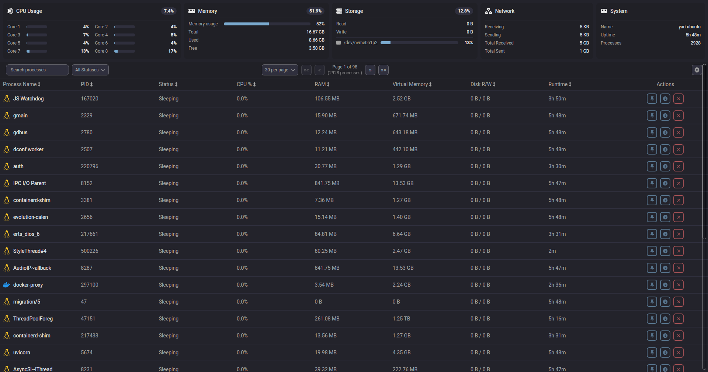

<div align="center">
  
  <h1>Rush</h1>
  <p>A modern system monitor for Linux inspired by <a href="https://github.com/Abdenasser/neohtop">NeoHtop</a> built with Svelte, Rust, and Tauri.</p>
</div>

<div align="center">
  <picture>
    
  </picture>
</div>

## Table of Contents
- [Features](#features)
- [Tech Stack](#tech-stack)
- [Getting Started](#getting-started)
  - [Prerequisites](#prerequisites)
  - [Installation](#installation)
- [Development](#development)
  - [Setup](#setup)
- [License](#license)

## Features
- 🚀 Real-time process monitoring
- 💻 CPU and Memory usage tracking
- 🎨 Beautiful, modern UI with dark/light themes
- 🔍 Advanced process search and filtering
- 📌 Pin important processes
- 🛠 Process management (kill processes)
- 🎯 Sort by any column
- 🔄 Auto-refresh system stats

### Search Functionality
Search for processes by name. Regular expressions are supported for advanced filtering.

Examples:
- `discord`: Returns processes with "discord" in the name.
- `^(\w+\.)+\w+$`: Shows processes with reverse domain name notation (e.g., com.docker.vmnetd)

## Tech Stack
- **Frontend**: SvelteKit, TypeScript
- **Backend**: Rust, Tauri
- **Styling**: TailwindCSS
- **Icons**: FontAwesome

## Getting Started

### Prerequisites
- Node.js (v16 or later)
- Rust (latest stable)

### Installation
Clone the repo
```bash
git clone https://github.com/yari-dewalt/rush.git
```

## Development

### Setup
```bash
# Install dependencies
npm install

# Run in development mode
npm run tauri dev

# Build for production
npm run tauri build
```

## License
This project is licensed under the MIT License - see the [LICENSE](LICENSE) file for details.